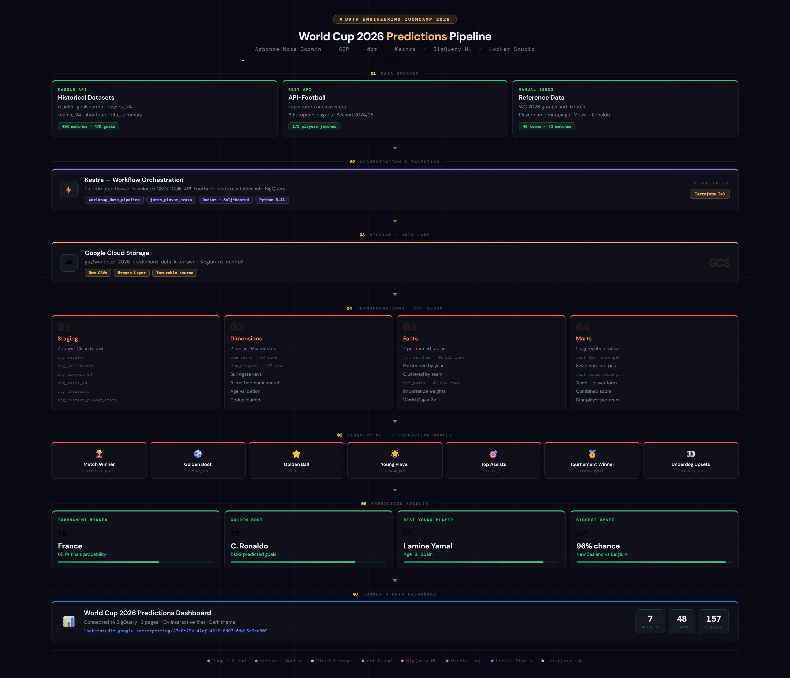
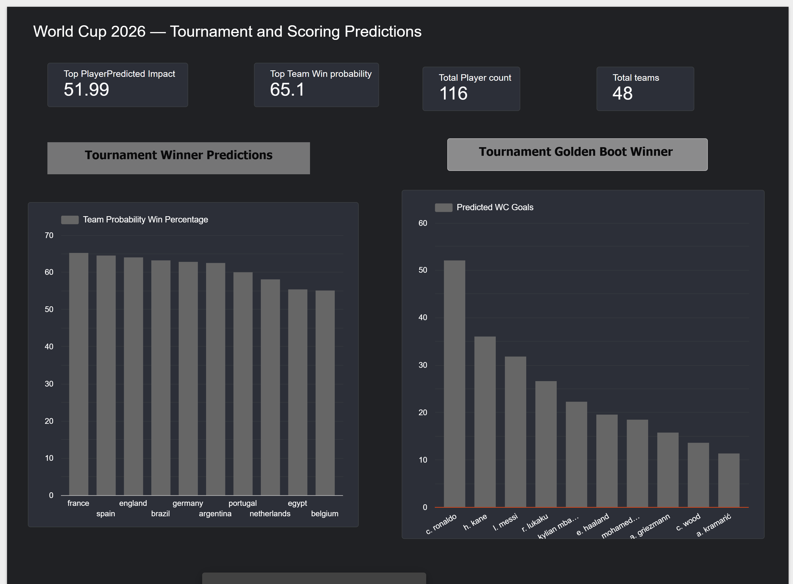
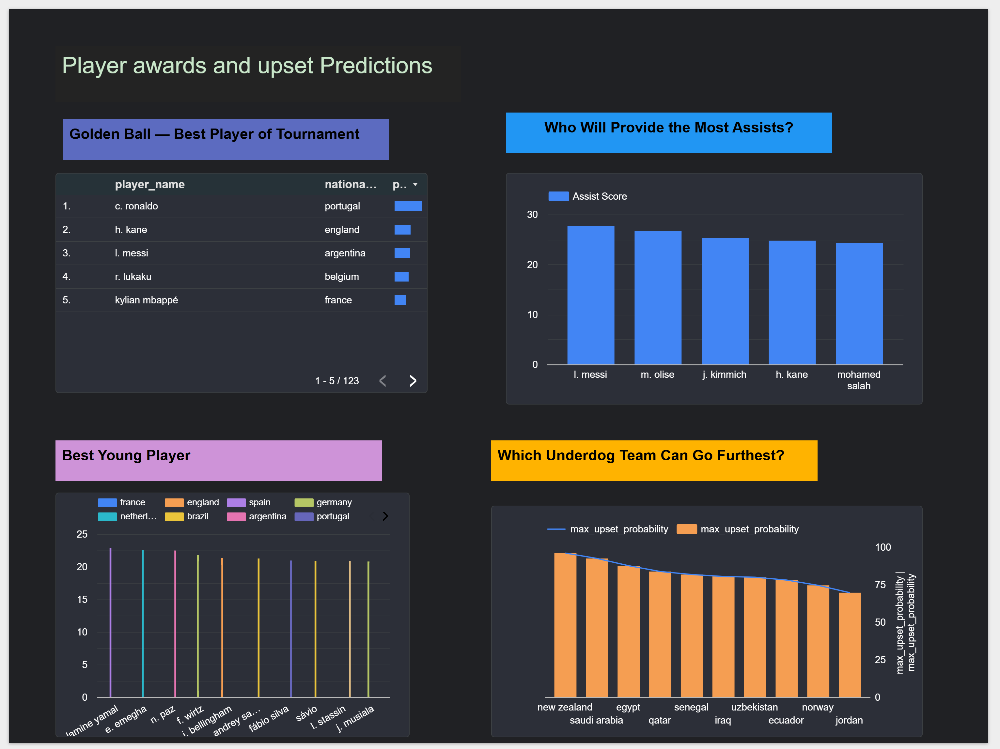

# ⚽ World Cup 2026 Predictions

🔗 **Live Dashboard**: [World Cup 2026 Predictions](https://lookerstudio.google.com/reporting/27e8c29a-42af-4216-8d97-0dd16c9ed809)

---

## Problem Description

Football is the world's most popular sport, yet most tournament predictions rely on gut feeling, media hype and fan bias rather than data. This project challenges that by building an end-to-end predictive modelling pipeline that uses real historical data and BigQuery ML to forecast what will actually happen at the FIFA World Cup 2026.

The FIFA World Cup 2026 is the biggest in history — 48 teams, 12 groups, 104 matches across USA, Canada and Mexico. With so many teams and matches, the complexity of predicting outcomes is enormous. This project solves that by:

- Collecting 100+ years of international football history (1872–2024)
- Fetching current 2024/25 player statistics from 6 top European leagues
- Using FIFA 24 ratings as a proxy for squad quality
- Training 7 BigQuery ML models to generate data-driven predictions

**Business questions answered:**

- 🏆 Which team will win the tournament?
- ⚽ Who will win the Golden Boot (top scorer)?
- ⭐ Who will win the Golden Ball (best player)?
- 🌟 Who will win Best Young Player (age 23 and under)?
- 🎯 Who will provide the most assists?
- 🐣 Which underdog teams could cause the biggest upsets?
- 📊 How will all 72 group stage matches end?

---

## Architecture


```
Kaggle Datasets + API-Football + Manual Seeds
                  ↓
          Kestra (Docker)              ← Orchestration
                  ↓
      Google Cloud Storage             ← Data Lake (Bronze layer)
                  ↓
       BigQuery raw_data               ← Raw Layer
                  ↓
            dbt Cloud                  ← Transformations
                  ↓
      BigQuery dbt_nagbonze            ← Analytics Layer
                  ↓
          BigQuery ML                  ← 7 Prediction Models
                  ↓
      BigQuery predictions             ← Prediction Results
                  ↓
         Looker Studio                 ← Dashboard

Terraform provisions all GCP infrastructure ← IaC
```


## Project Structure
```
worldcup-2026-predictions/
├── terraform/                    ← Infrastructure as Code
│   ├── main.tf
│   ├── variables.tf
│   ├── outputs.tf
│   └── terraform.tfvars
│
├── kestra/                       ← Workflow Orchestration
│   ├── docker-compose.yml
│   └── flows/
│       ├── worldcup_data_pipeline.yml
│       └── fetch_player_stats.yml
│
├── models/                       ← dbt Transformations
│   ├── staging/
│   ├── dimensions/
│   ├── facts/
│   └── marts/
│
├── seeds/
├── macros/
├── tests/
│
├── ml_models/                    ← BigQuery ML SQL Scripts
│   ├── train_match_winner.sql
│   ├── train_golden_boot.sql
│   ├── train_golden_ball.sql
│   ├── train_young_player.sql
│   ├── train_top_assists.sql
│   ├── train_tournament_winner.sql
│   ├── train_underdog.sql
│   └── predictions/
│       ├── group_stage_predictions.sql
│       ├── golden_boot_predictions.sql
│       ├── golden_ball_predictions.sql
│       ├── top_assists_predictions.sql
│       ├── young_player_predictions.sql
│       ├── tournament_winner_predictions.sql
│       └── underdog_predictions.sql
│
├── .env.example
├── .gitignore
├── dbt_project.yml
└── packages.yml
```

---

## How to Run

### Prerequisites
- Google Cloud Platform account
- Docker Desktop installed
- dbt Cloud account (free tier)
- Kaggle API key
- API-Football key (free tier)

### 1. Clone the repository
```bash
git clone https://github.com/Nosakharey/worldcup-2026-predictions.git
cd worldcup-2026-predictions
```

### 2. Configure environment variables
```bash
cp .env.example .env
# Edit .env with your actual credentials
```

### 3. Provision infrastructure
```bash
cd terraform
terraform init && terraform apply
```

### 4. Start Kestra
```bash
cd kestra
docker-compose up -d
# Open http://localhost:8080
# Add KV secrets: gcp_creds and api_football_key
# Run worldcup_data_pipeline flow
# Run fetch_player_stats flow
```

### 5. Run dbt transformations
```bash
dbt deps && dbt seed && dbt run && dbt test
```

### 6. Train ML models and generate predictions
```bash
# Open BigQuery console
# Run scripts in ml_models/ in this order:
# 1. All train_*.sql scripts (CREATE MODEL)
# 2. All predictions/*.sql scripts (ML.PREDICT)
```

---

## Dashboard
**Page 1 — Tournament and Scoring Predictions**


**Page 2 — Player Awards and Upset Predictions**


🔗 [World Cup 2026 Predictions Dashboard](https://lookerstudio.google.com/reporting/27e8c29a-42af-4216-8d97-0dd16c9ed809)

The dashboard is built on Looker Studio connected directly to BigQuery and contains 2 pages with 10 interactive tiles.

**Page 1 — Tournament and Scoring Predictions**

| Tile | Chart | Insight |
|------|-------|---------|
| KPI Scorecards | 4 summary cards | Top goals (51.99), Win probability (65.1%), Players tracked (116), Teams (48) |
| Tournament Winner | Bar chart | France leads at 65.1% followed by Spain (64.4%) and England (63.9%) |
| Golden Boot | Bar chart | Ronaldo predicted to score 51.99 goals, Kane 2nd with 35.95 |

**Page 2 — Player Awards and Upset Predictions**

| Tile | Chart | Insight |
|------|-------|---------|
| Golden Ball | Table | Ronaldo #1 with 52.42 tournament impact score |
| Top Assists | Bar chart | Messi leads with 27.7 combined assist score |
| Best Young Player | Chart | Lamine Yamal (age 18, Spain) predicted to win |
| Underdog Threats | Chart | New Zealand has 96% chance of upsetting Belgium |

---

## Key Findings

- **France** is the model's strongest tournament winner candidate at 65.1% finals probability
- **C. Ronaldo** dominates both Golden Boot and Golden Ball predictions despite playing in Saudi Arabia
- **Lamine Yamal** at just 18 years old is the standout young player prediction
- **New Zealand vs Belgium** is the most likely upset of the entire tournament at 96% probability
- **Belgium** is the most vulnerable top team — appears in 3 high upset probability matches

---


